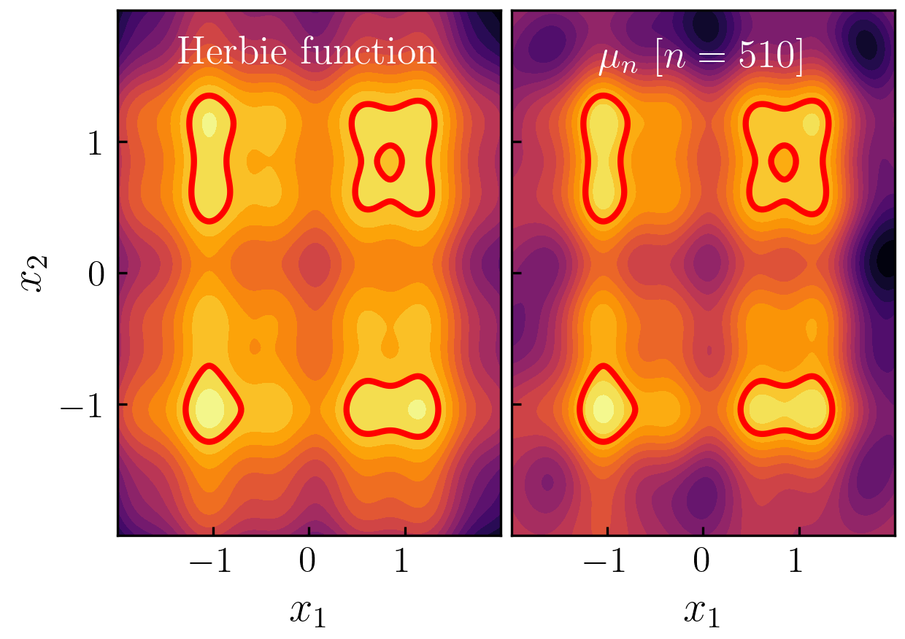

# GPIS

Gaussian-process importance sampling for estimating rare-event failure
probabilities in reliability problems with expensive black-box simulators.

The code fits a Gaussian process (GP) surrogate to a small set of simulator
evaluations, uses posterior failure probability to build KDE-based proposal
distributions, and estimates the failure probability with importance sampling,
multiple importance sampling (MIS), or multifidelity MIS.



## Main Reference

If you use this code, please cite:

```bibtex
@article{renganathan2026surrogate,
  title={Surrogate-Guided Adaptive Importance Sampling for Failure Probability Estimation},
  author={Renganathan, Ashwin and Booth, Annie S},
  journal={arXiv preprint arXiv:2603.20959},
  year={2026}
}
```

## What Is In This Repository?

- `experiments.py`: MPI-aware command-line runner for repeated experiments.
- `test_functions.py`: benchmark reliability problems: Herbie, four-branch,
  cantilever beam, welded beam, and round shaft.
- `surrogates.py`: BoTorch/GPyTorch GP fitting wrapper.
- `sampling_torch.py`: Torch-native distributions and KDE proposal helpers.
- `mis_estimator.py`: IS, MIS, and multifidelity MIS estimators.
- `*_example.py`: older standalone scripts for individual benchmarks.

## Installation

Create an environment with Python 3.10+ and install the scientific stack:

```bash
pip install numpy scipy pandas torch botorch gpytorch mpi4py matplotlib
```

If you are on a cluster, prefer the site-provided MPI module before installing
`mpi4py`:

```bash
module load mpi
pip install mpi4py
```

## Quick Start

Run one small Herbie experiment:

```bash
mpiexec -n 1 python experiments.py \
  --testfunction herbie \
  --wd herbie_demo \
  --t 2.1 \
  --m 10000 \
  --q 5 \
  --n_init 5 \
  --num_iters 20 \
  --REPS 1 \
  --estimator mis
```

Outputs are written under:

```text
results/herbie_demo/
```

The runner saves NumPy arrays for failure-probability traces and training data,
for example `FP_0.npy`, `X_0.npy`, and `Y_0.npy`.

## Common Runs

Four-branch benchmark:

```bash
mpiexec -n 1 python experiments.py \
  --testfunction fourbranch \
  --wd fourbranch_demo \
  --t 2.0 \
  --m 10000 \
  --q 5 \
  --n_init 5 \
  --num_iters 50 \
  --REPS 1 \
  --estimator mis
```

Cantilever beam benchmark:

```bash
mpiexec -n 1 python experiments.py \
  --testfunction cantilever \
  --wd cantilever_demo \
  --t 0.02 \
  --m 20000 \
  --q 5 \
  --n_init 5 \
  --num_iters 50 \
  --REPS 1 \
  --estimator is
```

Round-shaft benchmark:

```bash
mpiexec -n 1 python experiments.py \
  --testfunction roundshaft \
  --wd roundshaft_demo \
  --t 1.0 \
  --m 50000 \
  --q 5 \
  --n_init 5 \
  --num_iters 100 \
  --REPS 1 \
  --estimator mis
```

## Parallel Repetitions

`experiments.py` uses MPI ranks to split repetitions across workers. To run
eight independent repetitions on four ranks:

```bash
mpiexec -n 4 python experiments.py \
  --testfunction herbie \
  --wd herbie_parallel \
  --REPS 8 \
  --estimator mis
```

On SLURM, the same pattern is typically:

```bash
srun -n 4 python experiments.py --testfunction herbie --wd herbie_parallel --REPS 8
```

## Notes

- Torch code defaults to `torch.float64` and automatically uses CUDA when a GPU
  is available; otherwise it runs on CPU.
- Larger `--m` values improve the KDE pilot set but increase memory and runtime.
- Larger `--num_iters` values spend more simulator calls refining the proposal.
- `--estimator mis` uses multiple importance sampling; `--estimator is` uses
  the latest proposal; `--estimator mfmis` adds a surrogate correction term.
- Set `SLURM_CPUS_PER_TASK` to control Torch CPU thread usage on clusters.
